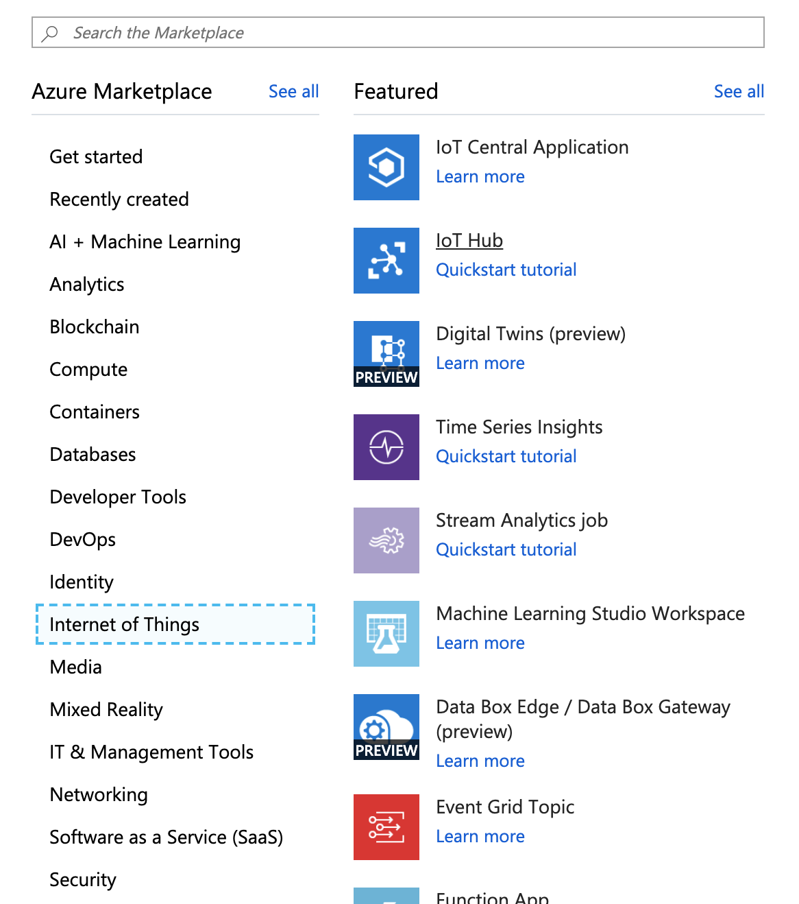
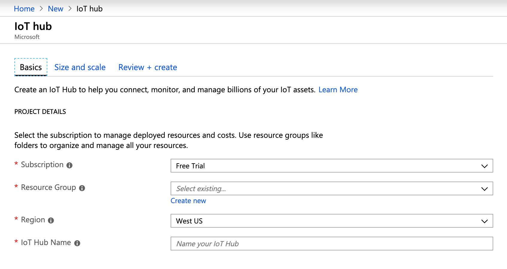
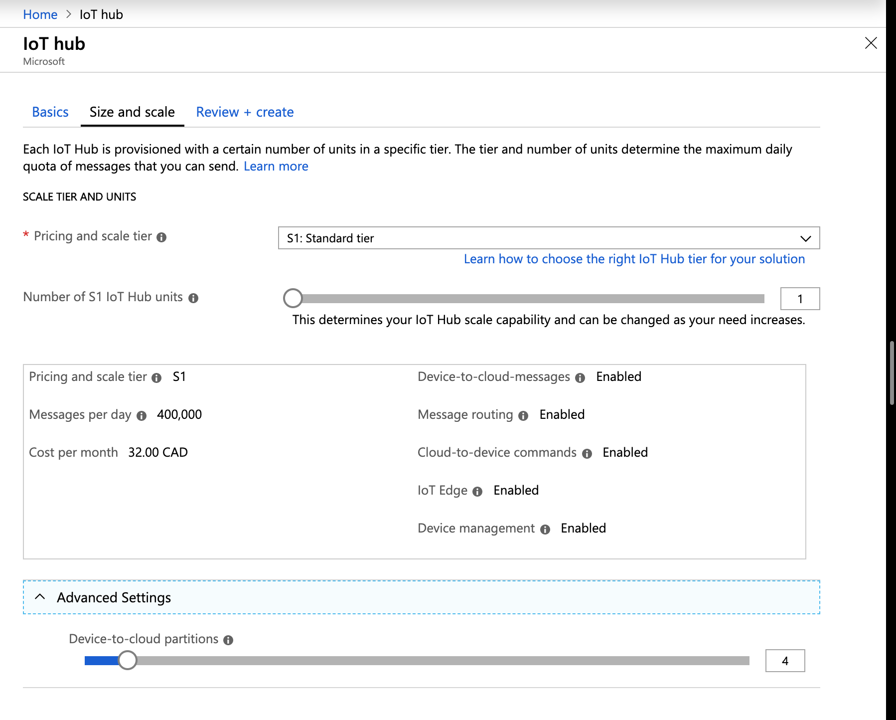
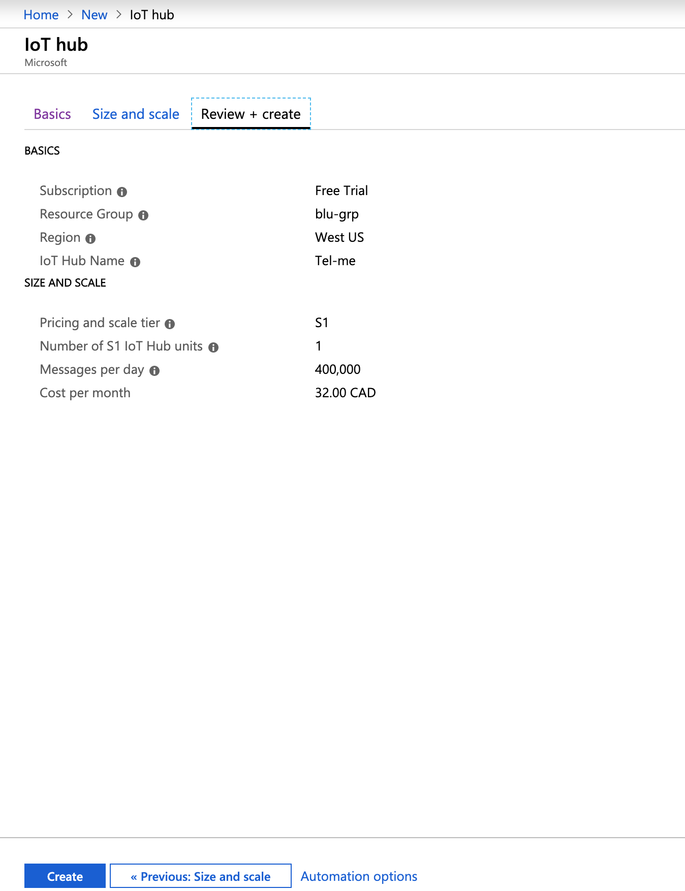
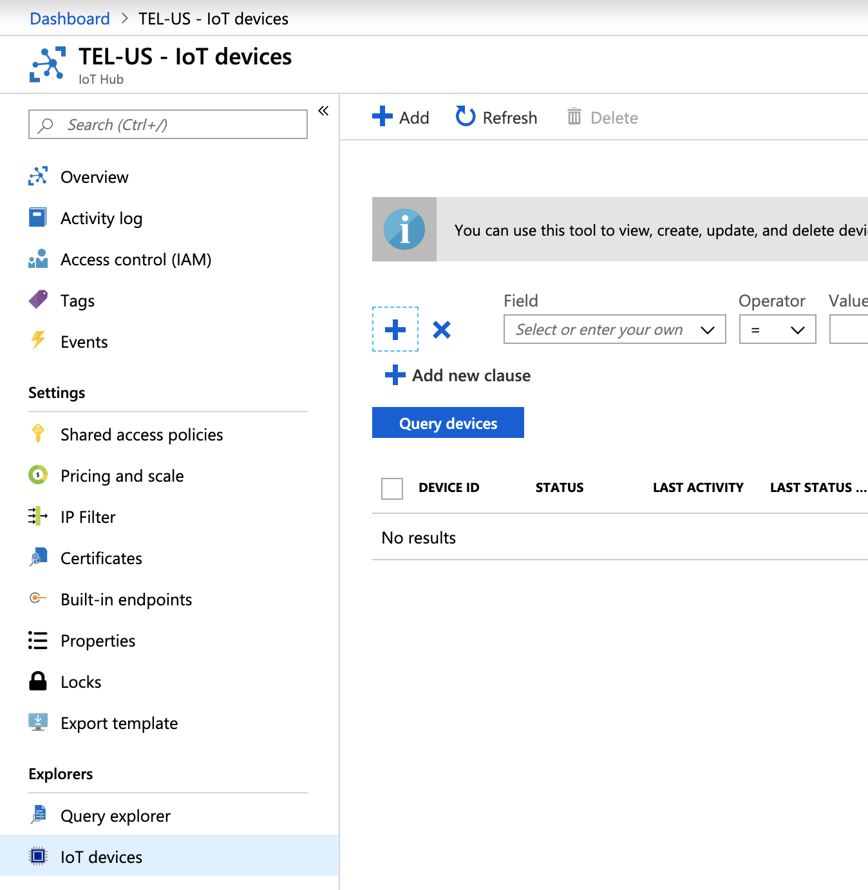
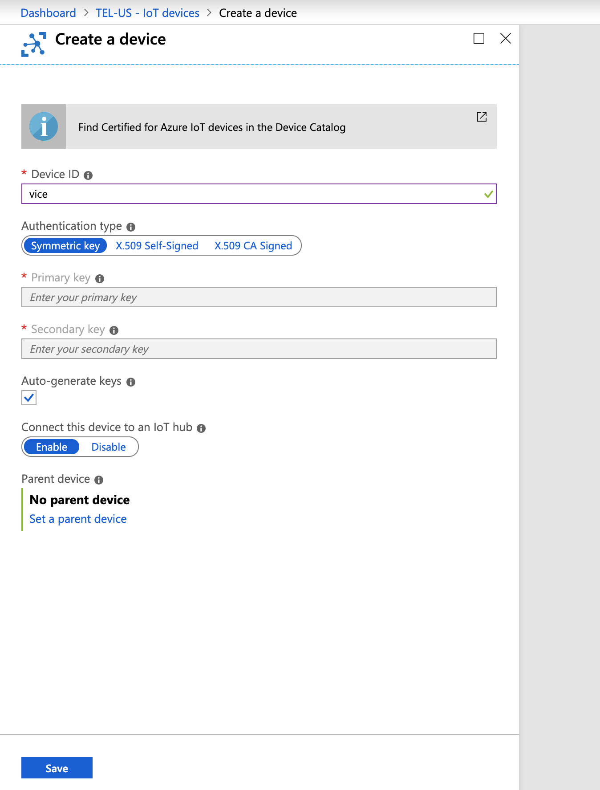
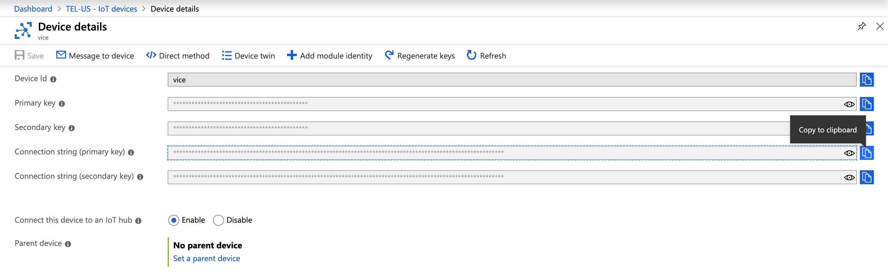
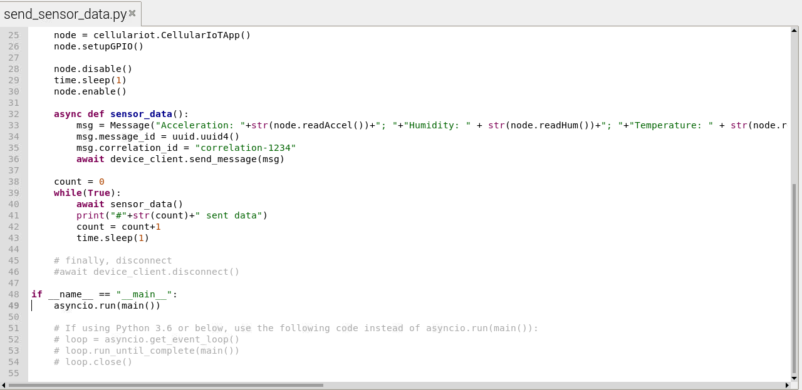
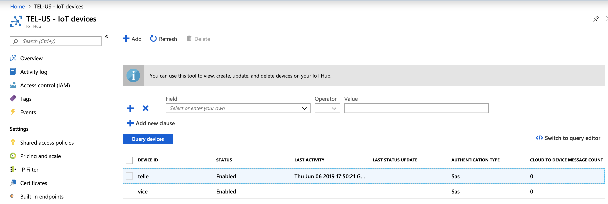
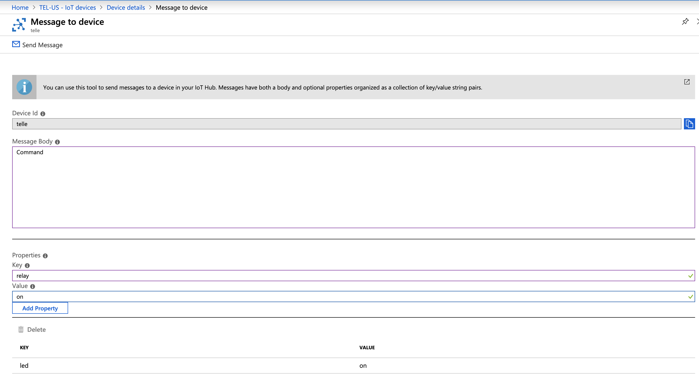

# TELUS-Devkit-Azure-Tutorial
This guide will cover how to setup a basic IoT device able to send temperature, humidity, acceleration, and lux data to the Azure IoT cloud service.

## Setting up and account

1. Sign up for an account with the microsoft Azure service at the following link:[Azure Portal](https://portal.azure.com/)

2. Once in the portal click **+Create a Resource** then select **Internet of Things**


3. Select **IoT Hub**, this should lead you to a page for creating the service.

    

    

    You will need to fill in the fields:

    **Subscription:** Select the free trial subscription.

    **Resource Group:** You may use an exisisting resource group or create a new one.

    **Region:** This is the region in which your IoT hub will be located. Make sure to select the region closest to you.

    **IoT Hub Name:** The name for your IoT Hub, this must be globally unique. A green check mark indicates your name is availible.
    Note that the IoT Hub service will be publically discoverable so avoid including sensitive information in naming it.

4. Next you will need to select **Size and Scale**

    

    **Pricing and scale tier:** You can choose from a variety of tiers depending on the number of features you require and how many messages you need to send through your solution per day. Since we the purpose of this is likely for rapid prototyping you may select the *Free Trial*. Ensure you select a tier which is capable of cloud to device and device to cloud communication. 

    **IoT Hub units:** The number of messages allowed per day depends on your hub's pricing tier.

    **Advanced / Device-to-cloud partitions:** This property relatesd the device-to-cloud messages to the number of simultaneous readers of the messages. Most IoT hubs only need four partitions

5. Click **Review + create** to review your choices and deploy your solution by selecting **create**

    

    ## Register a Device
    Click **IoT devices** menu in your newly created IoT hub

    

    Enter a **Device ID**. This can be any string you wish, Click ***Save**.

    

    Enter the newly created **Device details** and save the **Connection String (primary key)** in a accessible location.

    

    Now the IoT Hub is ready.

# Internet Connection for Raspberry Pi via PPP

In order to set up the hardware and PPP dialer please follow the steps found in the following tutorial: 
[TELUS-Devkit-IoT-Hardware-Tutorial](https://github.com/TELUS-Emerging-IoT/TELUS-Devkit-Hardware-Tutorial)

# Setting Up Azure Python SDK on Raspberry Pi

Open terminal in Raspian. From the command-line, install [azure-iot-sdk-python](https://github.com/Azure/azure-iot-sdk-python) using the command: 

```
    pip3 install azure-iot-device
```

## Setting up Sixfab CelluarIoT App Shield TELUS Edition Library on Raspberry Pi

1. Clone the repository by `git clone https://github.com/TELUS-Emerging-IoT/TELUS_Sixfab_RPi_CellularIoT_App_Shield.git`

2. `cd TELUS_Sixfab_RPi_CellularIoT_App_Shield`

3. `sudo python3 setup.py install`

Now we should be able to run an IoT hub example on Raspberry Pi.

## Run the azure IoT example on Raspberry Pi

1. Go to the **sample** folder by `cd sample`

2. Check Python3 version by `python3 --version`, if the version is 3.6 or below, you need to modify `send_sensor_data.py`.
      
      Open the script `send_sensor_data.py` using an editor of choice, comment `line 49` and uncomment `line 52 to 54`
      
      

2. Run `send_sensor_data.py` to start sending sensor data to Azure.

        command: `python3 send_sensor_data.py`

This causes the device to send Temperature, Humidity, Acceleration and Lux data to the Azure IoT hub service you created. Keep this terminal window and open another one for the following steps.

# Read Received Date from the Hub

## Setting Up Azure CLI

Azure CLI is a command-line tool which allows you to monitor the payloads sent from the device to Azure.

* To install Azure CLI, run the command: 

    `curl -L https://aka.ms/InstallAzureCli | bash`
    
* When it finishes, restart your terminal. Then, log in to Azure using the command: `az login`. A browser will open, log in using Azure credentials.

* Add IoT extension to Azure CLI

    `az extension add --name azure-cli-iot-ext`

* Set the device Primary Connection String copied a few steps ago as an environment variable by: 

    `export IOTHUB_DEVICE_CONNECTION_STRING="<your connection string here>"`

* Start monitoring by the command: 
    
    `az iot hub monitor-events --hub-name <your IoT Hub name> --output table`

# Send Command to Raspberry Pi Device via Azure Portal

To send message from cloud-to-device you must enter the **Message to device** tab as part of your device details




The device is waiting for a **Command**  event from the IoT Hub. You can add **Command** in the main body of the text and select the key and value you want to send over. Click **Add Property** and when you are ready click **Send Message**. 


On the device side you will see output similar to the following:


Which is essentially a dict containing the key and its related value.

Hope this Helps!
