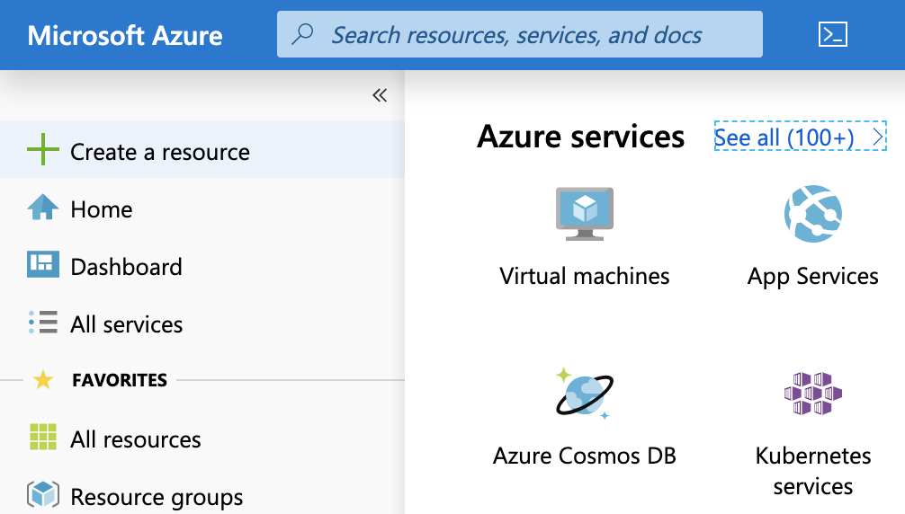

# TELUS-Devkit-Azure-Tutorial
This guide will cover how to setup a basic IoT device able to send temperature, humidity, acceleration, and lux data to the Azure IoT cloud service.
## Setting up and account
1. Sign up for an account with the microsoft Azure service at the following link:[Azure Portal](https://portal.azure.com/)
2. Once in the portal click **+Create a Resource** then select **Internet of Things**


3. Select **IoT Hub**, this should lead you to a page for creating the service.


You will need to fill in the fields:

**Subscription:** Select the free trial subscription.
**Resource Group:** You may use an exisisting resource group or create a new one.
**Region:** This is the region in which your IoT hub will be located. Make sure to select the region closest to you.
**IoT Hub Name:** The name for your IoT Hub, this must be globally unique. A green check mark indicates your name is availible.
Note that the IoT Hub service will be publically discoverable so avoid including sensitive information in naming it.

4. Next you will need to select **Size and Scale**


**Pricing and scale tier:** You can choose from a variety of tiers depending on the number of features you require and how many messages you need to send through your solution per day. Since we the purpose of this is likely for rapid prototyping you may select the *Free Trial*. Ensure you select a tier which is capable of cloud to device and device to cloud communication. 
**IoT Hub units:** The number of messages allowed per day depends on your hub's pricing tier.
**Advanced / Device-to-cloud partitions:** This property relatesd the device-to-cloud messages to the number of simultaneous readers of the messages. Most IoT hubs only need four partitions

5. Click **Review + create** to review your choices and deploy your solution by selecting **create**


## Register a Device
Click **IoT devices** menu in your newly created IoT hub


Enter a **Device ID**. This can be any string you wish, Click ***Save**.


Enter the newly created **Device details** and save the **Connection String (primary key)** in a accessible location.


Now the IoT Hub is ready.

# Internet Connection for Raspberry Pi via PPP
In order to set up the hardware and PPP dialer please follow the steps found in the following tutorial: 
[TELUS-Devkit-IoT-Hardware-Tutorial](https://github.com/TELUS-Emerging-IoT/TELUS-Devkit-Hardware-Tutorial)

# Setting Up Azure Python SDK on Raspberry Pi

1. Clone the repository containing the necessary files.
`git clone --recursive https://github.com/Azure/azure-iot-sdk-python.git`

2. Take not of your python3 version
`python --version`

3. Install required packages
```
sudo apt-get update

sudo apt-get install libboost-python-dev && sudo apt-get install libcurl4-openssl-dev && sudo apt-get install python3-dev

```
4. Compile Python modules

`cd azure-iot-sdk-python/build_all/linux`

`./setup.sh --python-version X.Y  #type your version instead of X.Y`

`./build.sh --build-python X.Y   #type your version instead of X.Y`

note if your version of python3 is 3.5.x just select 3.5. The build process may take a long time, that is normal.

## Setting up Sixfab CelluarIoT App Shield TELUS Edition Library on Raspberry Pi

`cd telus_azure_example/Sixfab_RPi_CellularIoT_App_Shield_telus`
`sudo python3 setup.py install`

Now we should be able to run an IoT hub example on Raspberry Pi.


## Run the azure IoT example on Raspberry Pi

1. Go to the **telus_azure_example** folder
2. Copy the file **iothub_client_sample.py** to **../azure-iot-sdk-python/device/samples**
3. Open the file in nano or vim and change the *device connection string* with the connection string you saved from Azure IoT hub.


4. Run the **iothub_client_sample.py** example with:

`python3 iothub_client_sample.py`

This causes the device to send Temperature, Humidity, Acceleration and Lux data to the Azure IoT hub service you created.

# Read Received Date from the Hub

## Setting Up Azure Cloud Shell
Go to the [Azure Shell](https://shell.azure.com/)

Approve the resource creation demand so that you may access the shell, wait for it to load.

We can monitor the data sent by the Pi, however we first need to add an extension to our shell

`az extension add -name azure-cli-iot-ext`

Now we can poll for data from our device with the following command: 
`az iot hub monitor-events --hub-name {your hub name}`
replace {your hub name} with the name of your service.

The output should look like the following:


